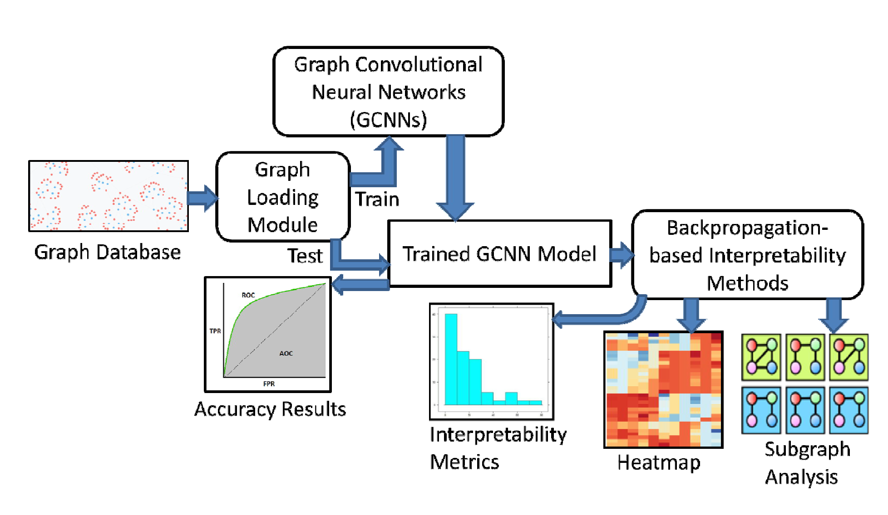

## Running the Code
### Requirements:
This codebase requires running on Linux OS. For Windows users, consider the Windows Subsystem for Linux (https://docs.microsoft.com/en-us/windows/wsl/install-win10). Experiment was performed on Ubuntu 18.04, with CUDA version 10.1 and PyTorch version 1.5.

### Setup
1. Install Python 3, . Optionally, you can install CUDA for faster training times if you have own a Nvidia GPU
   - (Optional) Install and create a virtual environment
   - Install PyTorch version 1.5
2. Install the requirements found in requirements.txt using `pip install -r requirements.txt`
3. Run main.py using the following options:
   - cuda=<0,1>: determine whether to use CUDA
   - gm=<GCN,GCND,DGCNN,DiffPool,DiffPoolD>: determine which model to use
   - data=<MUTAG,NCI-H23,TOX21_AR,PTC_FR,Callgraph>: determine which dataset to train on
   - retrain=<0,1>: decide whether to retrain the model. Previously trained models are stored in tmp/saved_models.
   - For example: `python3 main.py cuda=1 -gm=DGCNN -data=PTC_FR -retrain=0` trains a DGCNN model using the PTC_FR dataset while using the GPU
   - Additional run options can be found in config.yml

4. Collect your results from the results subdirectory, where log contains the information that is shown at the end of the execution while images contains the saliency visualisations
   
### Known Issues
Due to the limitations in specifications of Captum, we are unable to run DeepLIFT on version 0.2.0 as the changes from 0.1.0 to 0.2.0 did not consider our use case for graphs. Additionally, we required version 0.2.0 to run LayerGradCAM. Hence, we used version switching to run our experiments as and when the intepretability method is required. For LayerGradCAM, it is mostly used for images. Hence, you have to edit the library in site-packages -> captum -> attr -> _core -> layer -> grad_cam.py line 210: change to dim=0.

Currently, DiffPool (and its variant DiffPoolD) as well as the calculations of qualitative metrics do not support batch processing, this will be added in the future.

### Experiment Results
You can view our findings when we have successfully publish our paper.

## Description
### Architecture

<p align=center>
  
  <br />
  Fig. 1. Architecture of our framework
</p>

The architecture of our system is given in Fig. 1. We employ PyTorch v1.5 deep learning library [1] to
build GCNN models. The NetworkX library [2] is used to load and transform graphs as Python lists. We
modify Captum interpretability framework [3], originally developed for standard neural networks, to fit
with GCNNs, and integrate it with PyPlot API for visualisation. We perform experiments on a single
machine with 16GB, 3GHz Intel i5-7400 processor. Our GPU platform is GeForce GTX 1070 (8GB VRAM)
with CUDA 10.1.

### GCNN architectures and hyperparameters selection.
We perform 5-fold cross-validation. The learning rates and the number of epochs are selected from
{0.01, 0.001, 0.0001, 0.00001} and {50, 100, 150, 200}, respectively, via the ADAM optimizer. The
dropout rate is set as 0.5. More details are given below:

#### General Run Parameters
| Parameter | Value |
| --- | --- |
| Batch Size | 1 |
| Seed | 1800 |
| K-Folds | 5 |
| CUDA enabled | Yes |

#### Run Setup
| Configuration | Value |
| --- | --- |
| Processor | Intel Core i5-7400 3.00 Hz (4 cores) |
| RAM | 16GB |
| GPU | GeForce GTX 1070 8GBVRAM |
| Torch Version | 1.5 |
| CUDA Version | 10.1 |

#### Models Setup
MUTAG
| Configuration | GNN+GAP | GNN(D) | DGCNN | DiffPool | DiffPool(D) |
| --- | --- | --- | --- | --- | --- |
| Learning Rate | 0.001 | 0.0001 | 0.0001 | 0.0001 | 0.0001 |
| Epochs | 50 | 50 | 50 | 50 | 50 |
| SortPooling k |  |  | 0.6 |  |  |
| Dropout in Convolution Layer | 0.5 | 0.5 | 0.5 |  |  |
| Dropout in Prediction Layer |  |  | 0.5 |  |  |
| Assign Ratio for DiffPool |  |  |  | 0.1 | 0.25 |
| Number of Pooling Layers |  |  |  | 1 | 1 |
| Convolution Layer Sizes | 128-256-512 | 128-256-512 | 128-128-128-1 | 64-64-64 | 64-64-64 |
| Prediction Layer Sizes |  |  | 128 | 50-50-50 | 50-50-50 |

NCI-H23
| Configuration | GNN+GAP | GNN(D) | DGCNN | DiffPool | DiffPool(D) |
| --- | --- | --- | --- | --- | --- |
| Learning Rate | 0.001 | 0.0001 | 0.0001 | 0.0001 | 0.0001 |
| Epochs | 50 | 50 | 50 | 50 | 50 |
| SortPooling k |  |  | 0.6 |  |  |
| Dropout in Convolution Layer | 0.5 | 0.5 |  |  |  |
| Dropout in Prediction Layer |  |  | 0.5 |  |  |
| Assign Ratio for DiffPool |  |  |  | 0.1 | 0.25 |
| Number of Pooling Layers |  |  |  | 1 | 1 |
| Convolution Layer Sizes | 128-256-512 | 128-256-512 | 32-32-32-1 | 64-64-64 | 64-64-64 |
| Prediction Layer Sizes |  |  | 128 | 50-50-50 | 50-50-50 |


TOX21_AR
| Configuration | GNN+GAP | GNN(D) | DGCNN | DiffPool | DiffPool(D) |
| --- | --- | --- | --- | --- | --- |
| Learning Rate | 0.001 | 0.0001 | 0.0001 | 0.0001 | 0.0001 |
| Epochs | 50 | 50 | 50 | 50 | 50 |
| SortPooling k |  |  | 0.6 |  |  |
| Dropout in Convolution Layer | 0.5 | 0.5 |  |  |  |
| Dropout in Prediction Layer |  |  | 0.5 |  |  |
| Assign Ratio for DiffPool |  |  |  | 0.1 | 0.25 |
| Number of Pooling Layers |  |  |  | 1 | 1 |
| Convolution Layer Sizes | 128-256-512 | 128-256-512 | 32-32-32-1 | 64-64-64 | 64-64-64 |
| Prediction Layer Sizes |  |  | 128 | 50-50-50 | 50-50-50 |


PTC_FR
| Configuration | GNN+GAP | GNN(D) | DGCNN | DiffPool | DiffPool(D) |
| --- | --- | --- | --- | --- | --- |
| Learning Rate | 0.001 | 0.0001 | 0.0001 | 0.0001 | 0.0001 |
| Epochs | 50 | 50 | 50 | 50 | 50 |
| SortPooling k |  |  | 0.6 |  |  |
| Dropout in Convolution Layer | 0.5 | 0.5 | 0.5 |  |  |
| Dropout in Prediction Layer |  |  | 0.5 |  |  |
| Assign Ratio for DiffPool |  |  |  | 0.1 | 0.25 |
| Number of Pooling Layers |  |  |  | 1 | 1 |
| Convolution Layer Sizes | 128-256-512 | 128-256-512 | 128-128-128-1 | 64-64-64 | 64-64-64 |
| Prediction Layer Sizes |  |  | 128 | 50-50-50 | 50-50-50 |

Callgraph
| Configuration | GNN+GAP | GNN(D) | DGCNN | DiffPool | DiffPool(D) |
| --- | --- | --- | --- | --- | --- |
| Learning Rate | 0.001 | 0.0001 | 0.0001 | 0.0001 | 0.0001 |
| Epochs | 50 | 50 | 50 | 50 | 50 |
| SortPooling k |  |  | 0.6 |  |  |
| Dropout in Convolution Layer | 0.5 | 0.5 | 0.5 |  |  |
| Dropout in Prediction Layer |  |  | 0.5 |  |  |
| Assign Ratio for DiffPool |  |  |  | 0.25 | 0.25 |
| Number of Pooling Layers |  |  |  | 2 | 2 |
| Convolution Layer Sizes | 128-256-512 | 128-256-512 | 32-32-32-1 | 64-64-64 | 64-64-64 |
| Prediction Layer Sizes |  |  | 128 | 50-50-50 | 50-50-50 |

We follow the same GCNN architectures (e.g., number of different layers and their sizes) as in the
original papers, except for certain cases. In particular, we use the GCNN+GAP (as well as GCNN_D) architecture as in [4]: three graph convolutional layers of size 128, 256, and 512, respectively, followed by a GAP layer, and a softmax classifier.

Following [5], our DGCNN architecture has four graph convolution layers with 32, 32, 32, 1 output
channels, respectively. We set the k of SortPooling such that 60% graphs have nodes more than k. The
remaining layers consist of two 1-D convolutional layers and one dense layer. The first 1-D convolutional
layer has 16 output channels followed by a MaxPooling layer with filter size 2 and step size 2. The
second 1-D convolutional layer has 32 output channels, filter size 5 and step size 1. The dense layer has
128 hidden units followed by a softmax layer as the output layer.

For both DIFFPOOL [6] and DIFFPOOL_D, one DIFFPOOL layer is used for smaller datasets, whereas two
DIFFPOOL layers are employed over the larger callgraph. In each DIFFPOOL layer, the number of clusters
is set as 25% of the number of nodes before applying the DIFFPOOL. Every DIFFPOOL layer consists of
three GCNNs (each of size 64) for embedding generation and another three GCNNs (each of size 64) for
computing probabilistic assignments. The final embedding vector generated from the last DIFFPOOL
layer is used as input to three fully-connected layers (each having 50 hidden units), followed by a
softmax classifier.

Finally, we design a significant subgraph mining based graph classification model: Significant subgraph
features are identified via GraphSig [7], with following parameter values: minFreq 0.1% (the default
value used in [7]), while max-Pvalue is varied from 0.1-0.2 such that total number of significant subgraph
features found is between 100-200 per dataset. We observe that using more than 200 subgraph
features per dataset does not improve the classification accuracy, while it significantly increases the
running time. Next, each input graph is represented as a binary vector, based on the presence/ absence
of these significant subgraph features. The vectors are passed through a deep neural network (DNN)
consisting of three dense layers, each having 128 hidden units, and followed by a softmax layer for
classification. We refer to this architecture as GraphSig+DNN. We notice that GraphSig identifies
significant subgraphs when each node has a single binary feature; it is non-trivial to extend GraphSig for
nodes having multiple non-binary features. Thus, we cannot run GraphSig+DNN over callgraph.

### Datasets
We use five real-world graph datasets from two different categories. The first four belong to
bioinformatics benchmarks: MUTAG [8] is a dataset of mutagenic aromatic and heteroaromatic nitro
compounds classified according to their mutagenic effects on a bacterium. Tox21 AR [9] contains
qualitative toxicity measurements of compounds. PTC FR [10] is a dataset of chemical compounds
classified according to their carcinogenicity on female rats. These three datasets are obtained from:
https://ls11-www.cs.tu-dortmund.de/staff/morris/graphkerneldatasets. NCI-H23 is downloaded from:
https://pubchem.ncbi.nlm.nih.gov/, and contains anti-cancer screens for cell lung cancer over small
molecules. For experiments on NCI-H23, we randomly sample 500 active compounds and 2000 inactive
compounds [11].

Our last dataset is a callgraph dataset (https://github.com/quarkslab/dataset-call-graph-blogpostmaterial),
consisting of 1361 portable executable, 546 of them are sane files and 815 are malicious ones.
Callgraphs are extracted in a static way from these executables with the help of radare2. Each graph is
much larger in this dataset. For every node, which represents a function, we assign the most frequent
opcodes (and their counts) as its features.
Node features are binary except for callgraph. In callgraph a node (i.e., a function) can have multiple
(about 4) features (i.e., frequent opcodes), and we store in the feature matrix the count of these
features (opcodes) within a node (function).


### References
```
[1] A. Paszke, S. Gross, F. Massa, A. Lerer, J. Bradbury, G. Chanan, T. Killeen, Z. Lin, N. Gimelshein, L.
Antiga, A. Desmaison, A. K{\"{o}}pf, E. Yang, Z. DeVito, M. Raison, A. Tejani, S. Chilamkurthy, B. Steiner, L.
Fang, J. Bai, and S. Chintala, ``PyTorch: An Imperative Style, High-Performance Deep Learning Library,''
NeurIPS, 2019.
[2] A. A. Hagberg, D. A. Schult, and P. J. Swart, ``Exploring Network Structure, Dynamics, and Function
using NetworkX'', SciPy, 2008.
[3] N. Kokhlikyan, V. Miglani, M. Martin, E. Wang, J. Reynolds, A. Melnikov, N. Lunova, and O. Reblitz-
Richardson, ``PyTorch Captum,'', https://github.com/pytorch/captum , 2019.
[4] P. E. Pope, S. Kolouri, M. Rostami, C. E. Martin, and H. Hoffmann, “Explainability Methods for Graph
Convolutional Neural Networks”, CVPR, 2018.
[5] M. Zhang, Z. Cui, M. Neumann, and Y. Chen, “An End-to-End Deep Learning Architecture for Graph
Classification”, AAAI, 2018.
[6] Z. Ying, J. You, C. Morris, X. Ren, W. L. Hamilton, and J. Leskovec, “Hierarchical Graph Representation
Learning with Differentiable Pooling”, NeurIPS, 2018.
[7] S. Ranu and A. K. Singh, “GraphSig: A Scalable Approach to Mining Significant Subgraphs in Large
Graph Databases”, ICDE, 2009.
[8] A. K. Debnath, d. C. R. Lopez, G. Debnath, A. J. Shusterman, and C. Hansch, “Structure-activity
Relationship of Mutagenic Aromatic and Heteroaromatic Nitro Compounds. Correlation with Molecular
Orbital Energies and Hydrophobicity,” J. Medicinal Chemistry, vol. 34, 1991.
[9] Z. Wu, B. Ramsundar, E. N. Feinberg, J. Gomes, C. Geniesse, A. S. Pappu, K. Leswing, and V. S. Pande,
“MoleculeNet: A Benchmark for Molecular Machine Learning”, CoRR, vol. abs/1703.00564, 2017.
[10] H. Toivonen, A. Srinivasan, R. D. King, S. Kramer, and C. Helma, “Statistical Evaluation of the
Predictive Toxicology Challenge 2000-2001”, Bioinform., vol. 19, no. 10, 2003.
[11] X. Yan, H. Cheng, J. Han, and P. S. Yu, “Mining Significant Graph Patterns by Leap Search”, SIGMOD,
2008.
```
